 

  &nbsp;
  &nbsp;
    
  

 

---

## 👾 About Me

Junior Penetration Tester and fresh graduate from **Alexandria University** — Faculty of Computers & Data Science, Cybersecurity Department.

My work sits at the intersection of offensive security and real-world problem solving. I've done hands-on training in **web application penetration testing** at CyberGuardX Academy and worked as a **Cybersecurity Analyst trainee** at My-Communication. I'm comfortable on both sides of the fence — breaking things with purpose, and understanding what it takes to defend them.

On this profile you'll find projects covering web security, digital forensics, blockchain vulnerabilities, malware analysis, and cryptography — built during my degree and beyond.

---

## 🛠️ Skills & Tools

**Languages & Scripting**

**Platforms & Dev Tools**

**Security Tooling**

---

## 🏅 Certifications

---

## 🔬 Projects

<table>
  <tr>
    <td align="center">
      
    </td>
    <td align="center">
      
    </td>
    <td align="center">
      
    </td>
  </tr>
  <tr>
    <td align="center">
      
    </td>
    <td align="center">
      
    </td>
    <td align="center">
      
    </td>
  </tr>
</table>

<b>📂 View All Projects</b>

 

| Project | Description | Tech |
|---|---|---|
| **Adversarial Attacks on Graph-Based Bot Detection** | Twitter bot classifier with adversarial robustness testing — structural evasion & graph poisoning | Python, ML |
| **Crowdfunding Smart Contract Security** | Blockchain security lab — exploiting & securing a vulnerable crowdfunding smart contract | Solidity, Remix |
| **Forensic Investigation of a Phishing-Based Malware Attack** | Full DFIR investigation of a phishing malware disguised as a Gmail update | DFIR |
| **Zeus Banking Trojan** | Analysis and research on the Zeus banking trojan malware | Malware Analysis |
| **Incident Response Plan & DNS Tunneling Simulation** | Full IRP design with a real-world DNS tunneling attack simulation | Forensics, Networking |
| **Secure File Tool** | Python-based tool for secure file operations | Python |
| **Merkle–Damgård Hash Construction** | Python implementation of MD hash construction using SHA-256 | Python, Cryptography |
| **Information Retrieval System** | IR system comparing 3 retrieval models on the 20 Newsgroups dataset | Python, NLP |
| **Phone Store Management System** | Desktop app for inventory, sales, repairs & CRM | Java |
| **OOP Supermarket Management System** | Enterprise-grade Java app on MVC architecture | Java |
| **Hospital Database** | MySQL hospital DB with Python GUI for data visualization | Python, MySQL |

---

## 📊 Activity

<table width="100%">
  <tr>
    <td width="50%" align="center">
      
    </td>
    <td width="50%" align="center">
      
    </td>
  </tr>
  <tr>
    <td width="50%" align="center">
      
    </td>
    <td width="50%" align="center">
      
    </td>
  </tr>
</table>

---

## 💼 Experience

| Role | Organization | Period |
|---|---|---|
| 🔴 Web Application Penetration Testing Trainee | **CyberGuardX Academy** | Jul – Sep 2025 |
| 🔵 Cyber Security Analyst Trainee | **My-Communication** | Jul – Sep 2024 |

---

